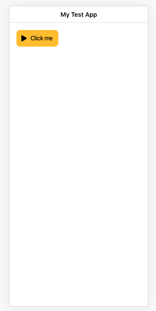

# Hello World

This example shows how to add Ionic to a regular React project generated with [Create React App](https://create-react-app.dev).

## Links

 * [Ionic Documentation Home](https://ionicframework.com/docs)
 * [UI Components](https://ionicframework.com/docs/components)
 * [IonButton](https://ionicframework.com/docs/api/button)
 * [IonToast](https://ionicframework.com/docs/api/toast)
 * [Ionicons](https://ionicons.com/)
 * [Theme Colors](https://ionicframework.com/docs/theming/basics#colors)
 * [Layered Colors](https://ionicframework.com/docs/theming/colors#layered-colors)
 * [Color Generator](https://ionicframework.com/docs/theming/color-generator)
 * [CSS Variables](https://ionicframework.com/docs/theming/css-variables)
 * [CSS Utilities](https://ionicframework.com/docs/layout/css-utilities)

## Ionic CSS Imports

To import all the Ionic styles copy the following snippet into `index.js` (taken from the [Ionic Packages](https://ionicframework.com/docs/installation/cdn#css) page):

```js
/* Core CSS required for Ionic components to work properly */
import '@ionic/react/css/core.css';

/* Basic CSS for apps built with Ionic */
import '@ionic/react/css/normalize.css';
import '@ionic/react/css/structure.css';
import '@ionic/react/css/typography.css';

/* Optional CSS utils that can be commented out */
import '@ionic/react/css/padding.css';
import '@ionic/react/css/float-elements.css';
import '@ionic/react/css/text-alignment.css';
import '@ionic/react/css/text-transformation.css';
import '@ionic/react/css/flex-utils.css';
import '@ionic/react/css/display.css';
```


### Notes: 

- npm install @ionic/react
- npm install ionicons

